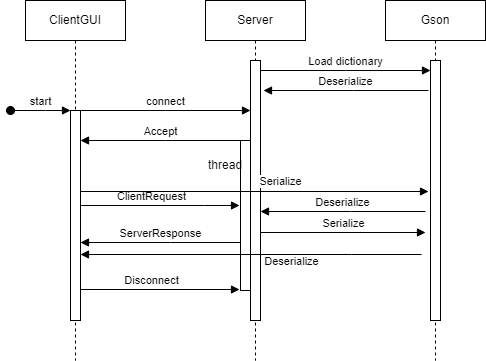

Student Name: `Jingcheng Qian`

Student ID: `1640690`

# Multi-threaded Dictionary Server

## Problem context

Implement a Multi-threaded Dictionary Server that can handle multiple client connections simultaneously. The server must support various operations for managing a dictionary, such as creating words, adding meanings, updating meanings, removing words, and searching for words, while ensuring thread safety and data consistency.

- **Reliable:** Maintain a stable connection between the server and clients, ensuring uninterrupted communication.
- **Concurrent:** Handle multiple client requests concurrently by synchronizing access to shared resources, guaranteeing thread safety and data consistency.
- **Robust:** Effectively handle errors and exceptions to maintain server stability and reliability.

## System Component

**Server:**

The core of the multi-threaded dictionary server, which is responsible for:

- Loading the dictionary data from a file at startup and saving it back to the file when modified.
- Listening for incoming client connections, using `TCP`.
- Handling multiple client connections concurrently using a `threadpool`.
- Processing various dictionary operations requested by clients.
- Ensuring thread safety and data consistency using  `synchronized` `ConcurrentHashMap`
- Logging all infos, warns and errors to debug and monitor.

**ClientGUI**:

Client-side graphical user interface, which allows users to:

- Connect/Disconnect to a server listening in `ip:port`
- Enter and send different types of dictionary requests to the server.
- Display responses from the server to inform the user about the success or failure of their requests.

**ClientRequest:**

Encapsulates the request sent from the client to the server, including:

- The type of operation requested by the client (`CREATE`, `ADD`, `UPDATE`, `REMOVE`, `SEARCH`).
- The necessary data required for the operation (`word, meanings, new meaning, old meaning`).

**ServerResponse:**

Represents the server's response to a client request, including:

- A status code indicating the result of the request (`SUCCESS`, `NO_ACTION`, `DUPLICATE`, etc.).
- Additional details if necessary, such as meaning(s) of searched word.

**Gson:**

The Gson library is used for serializing and deserializing Java objects to and from JSON format.

**slf4j:**

SLF4J is used as the logging framework for the server application.

## Class Design

Class diagram

Sequence diagram

The order of interaction is as below:

1. **Server** starts, loads dictionary and listens on `ip:port`.
2. **Client** Initiates connection.
3. **Server** accepts connection and allocate a thread to handle client request.
4. **Client** sends a request.
5. **Server** receives and processes request.
6. **Server** sends response back.
7. **Client** receives and displays response.
8. **Client** disconnects.

## Critical analysis

The design and implementation of the multi-threaded dictionary server involve several critical decisions regarding network communication, concurrency handling, and data serialization format. 

### 1. TCP Connection Instead of UDP

**Reliability**: TCP is a connection-oriented protocol, ensuring reliable data transmission between the client and server. It guarantees that all data packets arrive in the correct order and are retransmitted if lost, making it ideal for applications like a dictionary server where the integrity and order of data are crucial.

**Overhead**: TCP introduces additional transmision due to its connection setup, teardown, and state management processes. This can result in increased latency, especially for short-lived connections or when handling a large number of clients.

### 2. Thread Pool and Allocating a Thread Per Connection

**Scalability**: A thread pool helps manage the number of concurrent threads, preventing system resources from being overwhelmed when handling multiple clients. This design ensures the server can scale effectively, handling a reasonable number of connections without significant performance degradation.

**Efficiency**: Allocating a thread per request is particularly resource-intensive due to the overhead of establishing connections on TCP protocol. And using a thread pool is more efficient than creating a new thread for each client connection. It reduces the overhead associated with thread creation and destruction, leading to better utilization of CPU and memory resources.

**Blocking**: Compared to  a-thread-per-request, since each client connection occupies a thread, the pool can become fully occupied, causing new client connections to wait indefinitely.  For example, if a client connects to the server and sends requests but forgets to disconnect, the associated thread remains occupied, reducing the number of available threads. It can reduce the availability of threads in the pool, causing delays for other clients.

### 3.  JSON

**Data Size:** JSON has a relatively small footprint compared to some XML, reducing the amount of data transferred over the network, although it is sill larger than binary formats.

**Interpretable:** Compared to binary format, JSON is interpretable that makes debugging and logging easier. It is straightforward to inspect and understand, which helps during development.

## Excellence

### Error Notification

The server implementation uses the slf4j framework to provide detailed and categorized log, including `info`, `warn`, and `error` levels. The detailed logging not only helps debugging but also enhances user interaction by notifying the exact position of any issues encountered. It helps the manager of server understand what went wrong and suggests corrective actions.

The system utilizes `Request` and `Response` enumerations to define possible actions and their outcomes in a clear, structured way. This design simplifies the handling of client-server interactions by ensuring that all request types and responses are predefined and consistent. It minimizes the risk of errors caused by invalid or unexpected request types.

## Creativity

### ConcurrentHashMap

The server uses `ConcurrentHashMap` to store and manage the dictionary data.

**Efficiency and Scalable**: `ConcurrentHashMap` combined with careful synchronization of `list` operations allows multiple threads to read and write to the map concurrently without locking the entire structure (compared to `HashMap`). This improves the server's ability to handle multiple client requests simultaneously.

**Reliable**: The use of `ConcurrentHashMap` guarantees thread safety for operations such as `putIfAbsent` and `remove`, ensuring that modifications to the dictionary are atomic. This eliminates the risk of data inconsistency or race conditions when multiple clients attempt to modify the dictionary concurrently.

### Timeout Set

To reduce the impact of client connections blocking server threads indefinitely, the server utilizes the `setSoTimeout` method. This introduces a timeout for read operations, ensuring that the server does not wait indefinitely for a request from a client.

**Availability**: By preventing threads from being occupied by inactive clients, the server maintains a higher level of availability, ensuring that new client connections can be serviced promptly.

